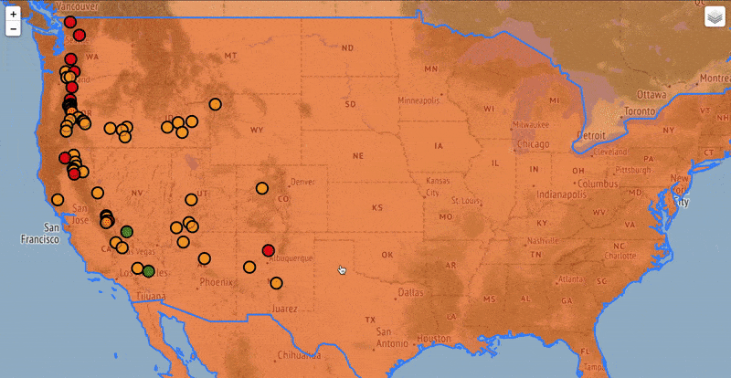

# python_MapMarkerGenerator
Folio map markers (USA Volcanoes) and GeoJson polygon (2005 world population)    

Map currently has two layers.   
One layer is markers made from a data frame of Volcanoes in USA.  
Another is world population from 2005 from GeoJson polygon with poulation level represented by opacity levels of color orange.     

